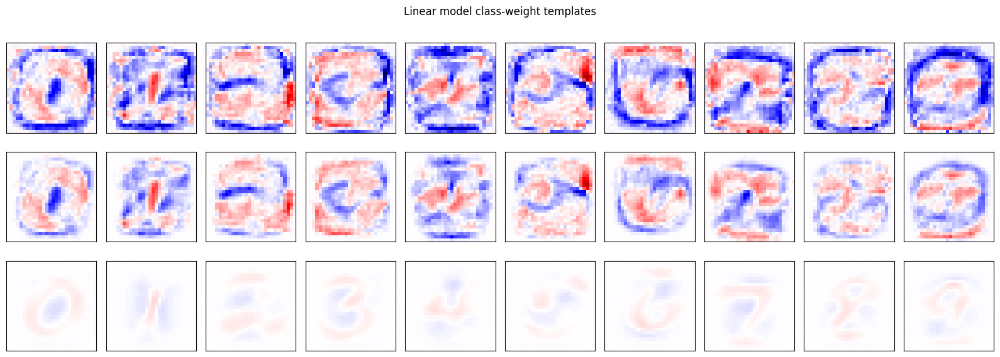
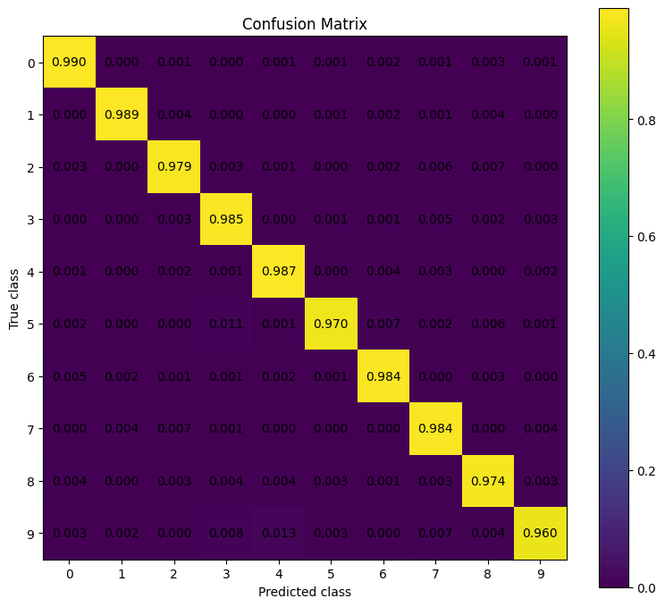
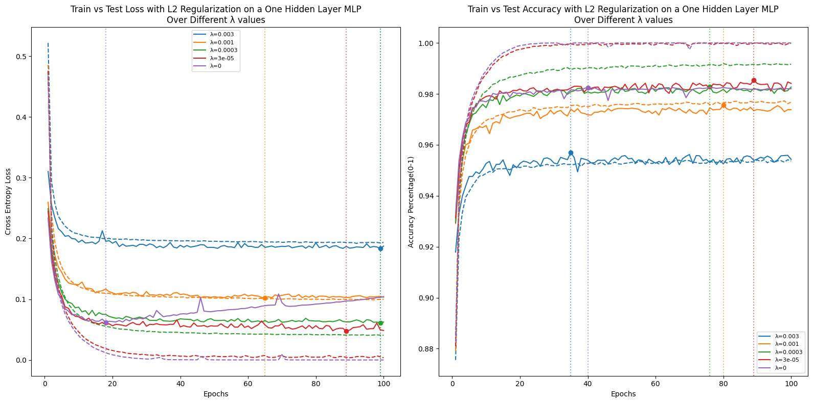

# MNIST Digit Classification with MLPs (PyTorch)

Train and analyze a linear classifier plus shallow/deep MLP baselines on MNIST, with an emphasis on **generalization** (L2 regularization, overfitting curves) and **error analysis** (confusion matrix).

> Completed following the scope of a Statistical Machine Learning course project (predefined tasks).  
> Implementation, evaluation, and visualizations were done by me in PyTorch, with a focus on clear experiment structure and interpretable results.

Notebook: [ML_project.ipynb](Notebook/ML_project.ipynb)

Report: [Stat_ML_project_report.pdf](Report/Stat_ML_project_report.pdf)

## What’s inside

- Compare three model families (no L2):
  - **Linear model** (no hidden layers)
  - **Shallow MLP** (1 hidden layer)
  - **Deep MLP** (2 hidden layers)
- Study **L2 regularization** on linear models and visualize learned weight “templates” per class (28×28).
- Select the best MLP and evaluate it with:
  - **test accuracy**
  - **confusion matrix built from scratch**
  - **discussion of common misclassifications**
- Retrain the chosen MLP with different L2 strengths to observe **overfitting** (train vs test loss & accuracy).
- Track **per-class accuracy** over epochs to see which digits are learned faster.

(See the report for full methodology, plots, and discussion.)

## Results (summary)

### Linear baseline + interpretability (L2 on linear model)
As a baseline, a **linear classifier (no hidden layers)** was trained on MNIST.  
To study the effect of **L2 regularization**, I trained the linear model under multiple values of λ (none /low /high) and visualized the learned class weights.  

Each class weight vector can be reshaped to **28×28** to form an interpretable “template” of what the model associates with each digit.

### Best MLP model (from report):
- Best-performing model selected: **Shallow MLP (784 → 512 → 10)**  
- Test accuracy: **98.05%**
- Confusion matrix analysis highlights stronger confusion for digit **9** (e.g., with 3/4/7), and some confusion of **5** as **3**, consistent with visual similarity.

### Regularization and Overfitting (chosen MLP):
- Best L2 setting reported: **λ = 3×10⁻⁵**
- Achieved test loss ≈ **0.048** and test accuracy ≈ **98.5%** (at ~epoch 89), with improved generalization and reduced overfitting compared to no regularization.

## Implementation details

- Data: MNIST via `torchvision.datasets.MNIST`
- Input: images flattened to 784-dim vectors
- Loss: Cross-Entropy
- Optimizer: Adam
- Regularization: L2 weight decay tuning (λ)
- Evaluation: accuracy + confusion matrix implemented from scratch

## Reproducibility
Results can vary slightly due to random initialization and batching.
